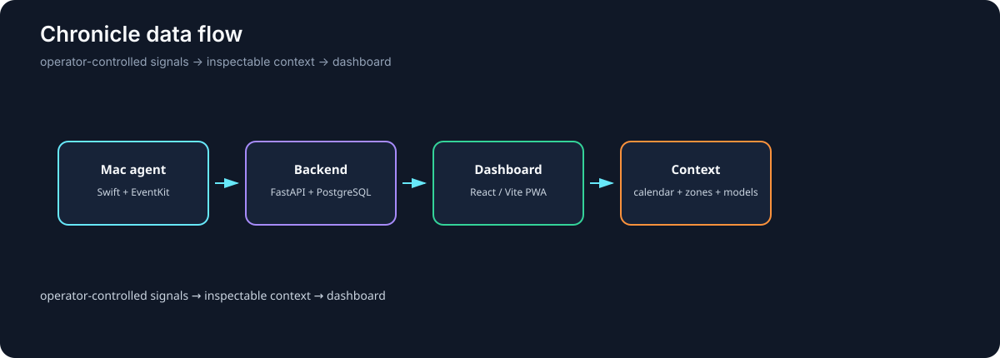
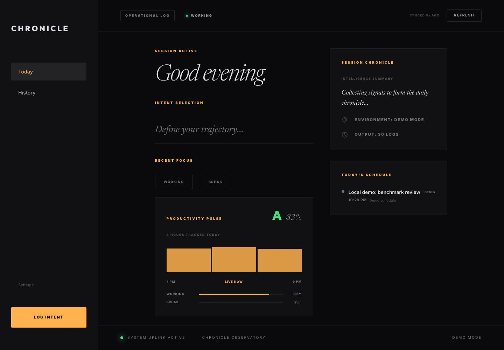

# Chronicle

Self-hosted activity and calendar context system with a native macOS agent, FastAPI backend, and responsive web dashboard.



## Why I Built It

I wanted a personal tool whose collection path is visible and configurable, rather than an opaque productivity score. Chronicle keeps the native capture agent, backend, calendar integration, and dashboard in one inspectable system.

## Demo



This local capture shows the Today dashboard with seeded demo activity and a synthetic schedule. It contains no personal activity or calendar data.

## What It Does

The Mac agent samples configured application activity and writes selected sessions to the backend. iPhone Shortcuts report user-defined zone enter/leave events, the dashboard combines activity with calendar context, and deterministic or model-backed summaries surface the day's state. A tracking toggle and configurable sleep window keep collection operator-controlled.

## Key Engineering Work

- Built a Swift/SwiftUI macOS agent with EventKit and a background helper.
- Built the FastAPI, SQLAlchemy, and PostgreSQL backend with auth, zones, summaries, and diagnostics.
- Built the React/Vite PWA with Today, history, settings, and iPhone setup flows.
- Added provider routing with deterministic fallbacks when the model budget is exhausted.
- Added context check-ins, calendar event classification, deadline nudges, and bounded LLM usage.
- Added backend tests, a reproducible web build, and a native Xcode build path.

## Architecture

```text
iPhone Shortcuts ──┐
                    ├──► FastAPI + PostgreSQL ──► React/Vite dashboard
macOS Swift agent ──┘             │
                                  ├── calendar and zone context
                                  └── model-backed or deterministic summaries
```

The repository contains the application code, not the author's activity data. Location is represented as user-defined zone events, not continuously uploaded raw GPS coordinates.

## Results

The backend test suite covers analytics, provider routing, zones, and summary helpers. The web production build passes, the native client is generated from `mac_native/project.yml`, and the repository's CI verifies both the backend/web path and the macOS Xcode build.

This is an experimental single-user tool, not employee-monitoring software or a validated measure of productivity. It still needs product screenshots, long-duration resource measurements, and an external security review before a public deployment.

## Tech Stack

Swift, SwiftUI, EventKit, FastAPI, SQLAlchemy, PostgreSQL, React, TypeScript, Vite, and Railway-compatible deployment configuration.

## Running Locally

Backend:

```bash
cd backend
python3 -m venv .venv
source .venv/bin/activate
pip install -r requirements.txt
cp .env.example .env
uvicorn app.main:app --reload
```

Set `DATABASE_URL`, `DASHBOARD_USER`, `DASHBOARD_PASS`, and `SECRET_KEY`; model API keys are optional when using deterministic fallbacks. Build the web client with `npm install && npm run build` from `web/`. Open `mac_native/Chronicle.xcodeproj` in Xcode to build the macOS client and grant only the permissions you intend to use.

Review the privacy and security boundaries in the source before exposing the backend to a network. MIT License.
